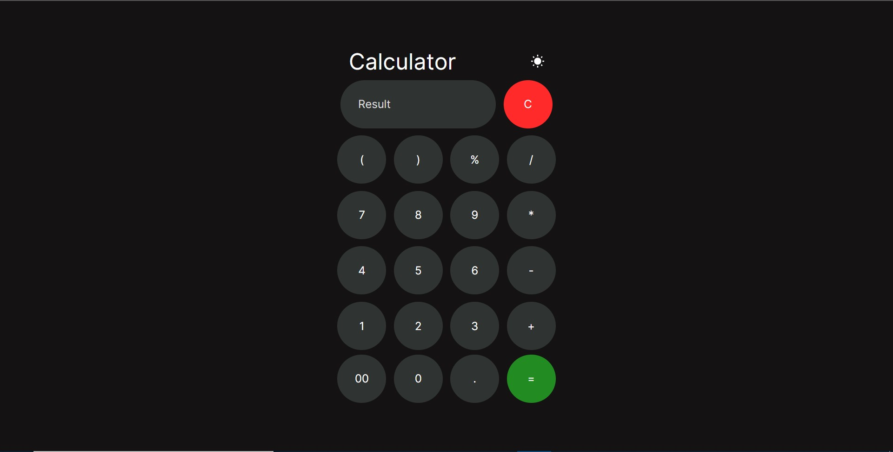
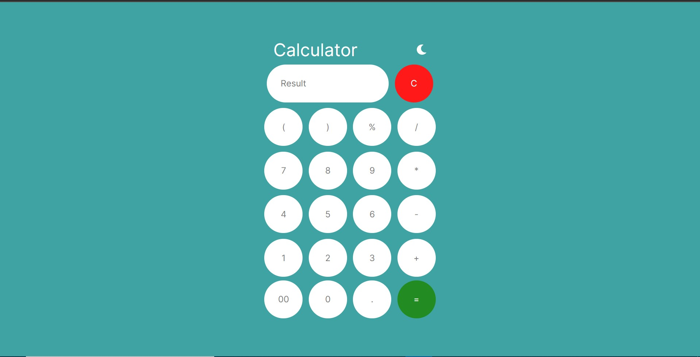

# Calculator

A normal web app Calculator built using HTML, CSS, JavaScript with two modes enabled.

## Tech-Stacks

- [HTML](https://www.w3schools.com/html/)
- [CSS](https://www.w3schools.com/css/)
- [JavaScript](https://www.w3schools.com/js/)
- Text Editor : [Visual Studio Code](https://code.visualstudio.com/Download)

## Modes

- Dark

Default is dark mode only.

-Light

## Demo

Click here to see it's working. [Link](https://gulshan986.github.io/Project-Calculator/) 
